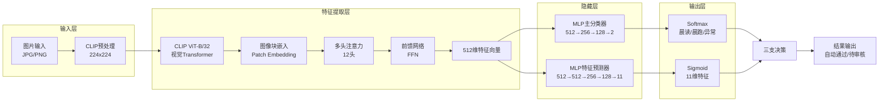
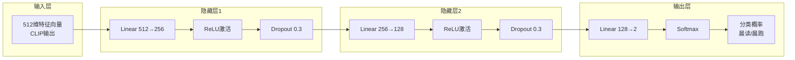
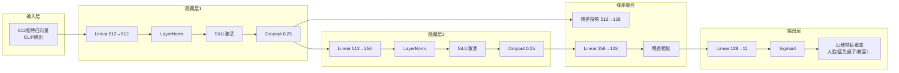
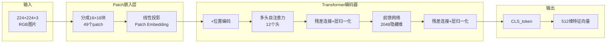
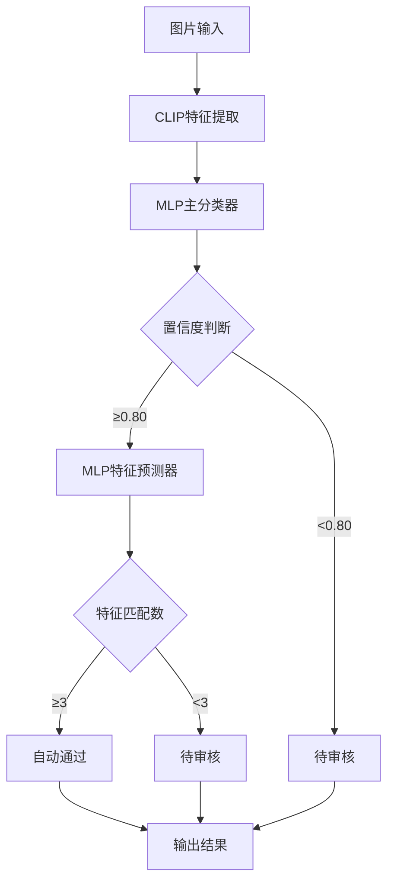
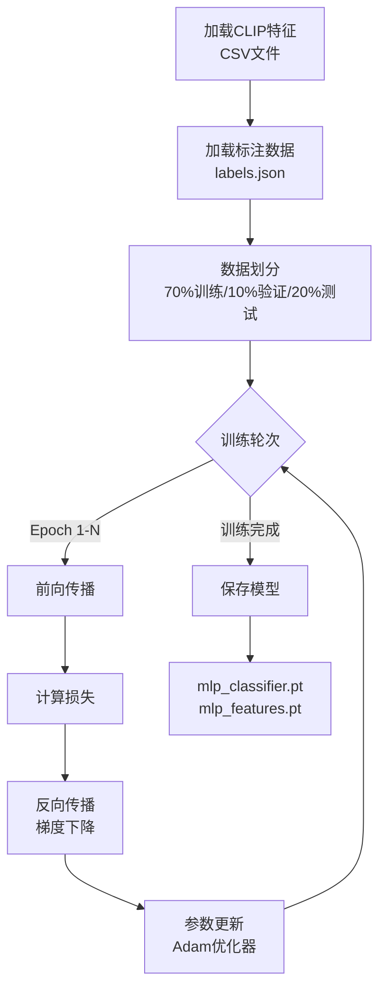
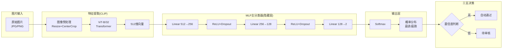
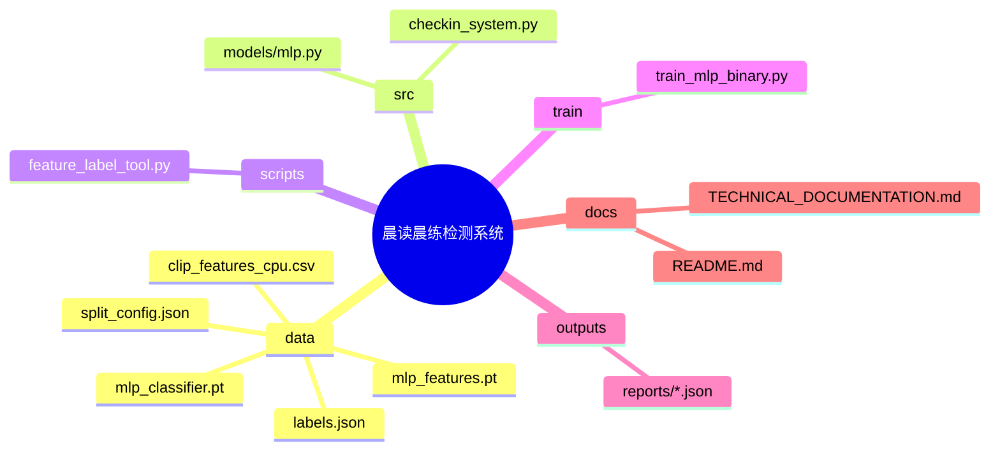
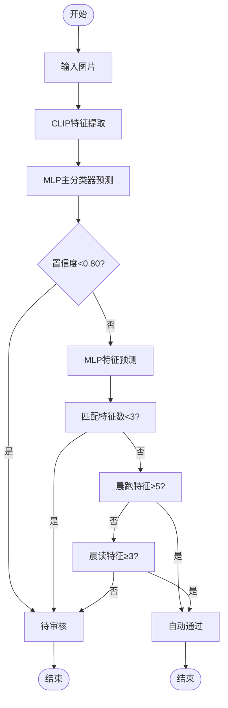
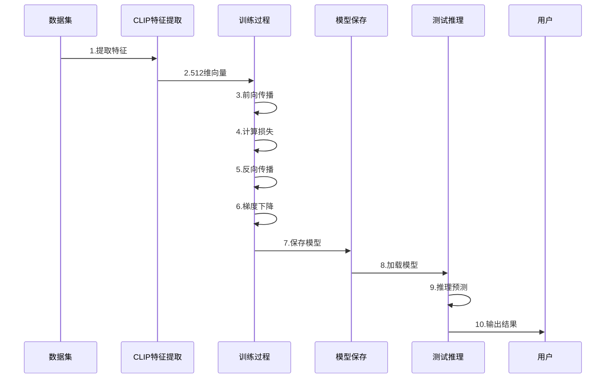

# 晨读晨练签到检测系统 - 架构图

## 1. 整体系统架构图

---

## 2. MLP主分类器详细结构

---

## 3. MLP特征预测器详细结构

---

## 4. CLIP ViT-B/32 内部结构

---

## 5. 三支决策流程图

---

## 6. 训练流程图

---

## 7. 信息流完整路径图

---

## 8. 项目文件结构图

---

## 9. 决策规则流程图

---

## 10. 完整训练数据流

